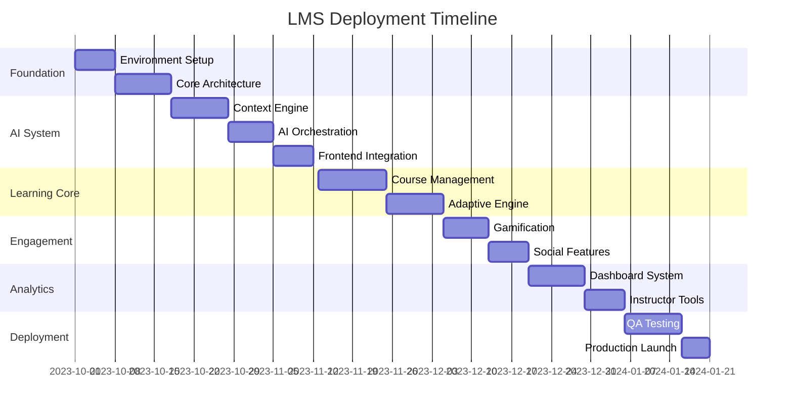

# AstraLearn

## Detailed Implementation Plan: Advanced LMS with Context-Aware AI

### Phase 1: Foundation Setup (2 Weeks)
1. **Environment Configuration**
   - Set up Node.js v18+ environments
   - Install MongoDB v6+ with Atlas cluster configuration
   - Initialize Git repository with proper branching strategy
   - Configure monorepo structure (client/server/shared)

2. **Core Architecture**
   - Implement Express.js REST API framework
   - Configure React Vite frontend with Tailwind CSS
   - Establish JWT authentication flow
   - Set up Mongoose ODM with schema stubs

3. **AI Infrastructure**
   - Create OpenRouter API integration module
   - Implement API key management system
   - Build base prompt engineering templates

### Phase 2: Context-Aware AI System (3 Weeks)
1. **Context Gathering Engine**
   - User context module (learning style, progress)
   - Course context service (structure, objectives)
   - Lesson context extractor (key topics, position)
   - Progress analytics aggregator

2. **AI Orchestration Layer**
   - Context packaging system (JSON schema)
   - Dynamic prompt injection mechanism
   - Conversation state management
   - Response caching layer

3. **Frontend AI Interface**
   - Floating assistant component
   - Context-aware chat UI
   - Lesson-specific trigger system
   - Response formatting pipeline

### Phase 3: Learning Core (3 Weeks)
1. **Course Management**
   - Module/Lesson hierarchy builder
   - Content editor (RichText + Media)
   - Metadata management (difficulty, objectives)
   - Version control system

2. **Adaptive Learning Engine**
   - Learning style assessment tool
   - Progress tracking service
   - Dynamic path calculation algorithm
   - Content recommendation engine

3. **Assessment System**
   - Quiz builder framework
   - Automated grading pipeline
   - AI feedback generator
   - Knowledge gap analyzer

### Phase 4: Engagement Features (2 Weeks)
1. **Gamification System**
   - Badge/achievement framework
   - Points calculation service
   - Leaderboard component
   - Streak tracking mechanism

2. **Social Learning**
   - Study group management
   - Real-time collaboration sockets
   - Peer discussion forums
   - Knowledge sharing hub

### Phase 5: Analytics & Insights (2 Weeks)
1. **Dashboard Framework**
   - Data aggregation pipeline
   - Visualization component library
   - Custom report generator
   - Predictive analytics module

2. **Instructor Tools**
   - Class performance monitor
   - Engagement heatmaps
   - Learning gap detector
   - Intervention suggestion system

### Phase 6: Testing & Deployment (2 Weeks)
1. **Quality Assurance**
   - Context AI validation suite
   - Learning path simulation tests
   - Performance benchmarking
   - Security audit (OWASP standards)

2. **Deployment Pipeline**
   - Docker containerization
   - CI/CD configuration
   - Load testing setup
   - Monitoring/alerting system

## Critical Implementation Details

### Context-Aware AI Workflow
1. **User Interaction Flow:**
   - User opens lesson → UI embeds lessonID/courseID
   - "Ask AI" click → captures user/lesson context
   - Context package → AI service → Context-enhanced prompt
   - OpenRouter API → Contextual response → UI

2. **Context Packaging:**
   ```javascript
   {
     user: { 
       id: "usr_123", 
       learningStyle: "visual", 
       progress: 67% 
     },
     course: {
       id: "cs_101",
       title: "Web Development",
       modules: [...]
     },
     lesson: {
       id: "les_205",
       title: "CSS Flexbox",
       objectives: [...],
       contentSummary: "..."
     },
     analytics: {
       recentScores: [85, 92, 78],
       timeSpent: "2.3h"
     }
   }
   ```

### Performance Optimization Strategy
1. **Caching Layers:**
   - Redis cache for common AI responses
   - Client-side session caching
   - Prefetching for predicted next lessons

2. **Database Optimization:**
   - Indexing on lesson/course relationships
   - Materialized views for analytics
   - Sharding for user progress data

3. **AI Efficiency:**
   - Context diffing (only send changes)
   - Response streaming
   - Fallback to local models when possible

### Security Implementation
1. **Data Protection:**
   - Context data encryption at rest
   - Strict data minimization for AI prompts
   - GDPR-compliant retention policies

2. **API Security:**
   - Rate limiting on AI endpoints
   - Context access authorization checks
   - AI output sanitization

### Testing Strategy
1. **AI Context Validation:**
   - Context accuracy tests (100% match requirements)
   - Lesson-boundary test cases
   - Progressive disclosure verification

2. **Learning Path Tests:**
   - Style adaptation simulations
   - Knowledge gap remediation scenarios
   - Cross-module progression checks

## Deployment Roadmap



## Key Technical Decisions

1. **Context Propagation:**
   - Use React Context API for frontend state
   - Encapsulate context in JWT for API calls
   - Implement middleware for context enrichment

2. **AI Service Architecture:**
   - Isolated AI service container
   - Message queue for request processing
   - Circuit breaker pattern for API failures

3. **Real-time Updates:**
   - WebSockets for progress sync
   - Server-sent events for content updates
   - Operational transforms for collaborative features

4. **Analytics Pipeline:**
   - Time-series database for events
   - Batch processing for nightly aggregates
   - Real-time streaming for dashboards

## Risk Mitigation

1. **AI Accuracy Risks:**
   - Implement response validation layer
   - Create fallback to human support
   - Build feedback loop for model improvement

2. **Performance Risks:**
   - Auto-scaling AI service tier
   - Content delivery network for media
   - Database read replicas for analytics

3. **Adoption Risks:**
   - Progressive feature rollout
   - Onboarding tutorial system
   - Contextual help tooltips

This implementation plan provides a comprehensive roadmap for building the context-aware LMS while addressing all technical aspects without writing actual code. The phased approach ensures foundational elements are solid before adding complex AI functionality, with particular emphasis on the context-handling architecture that differentiates this platform.